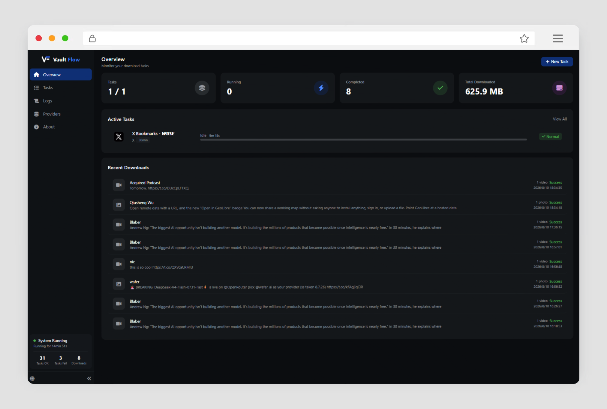
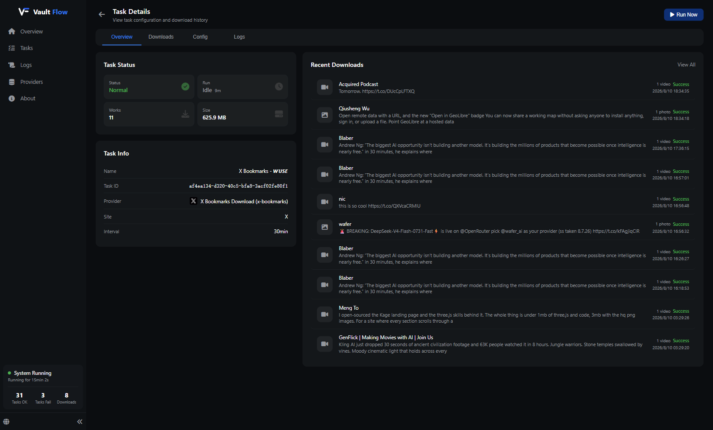
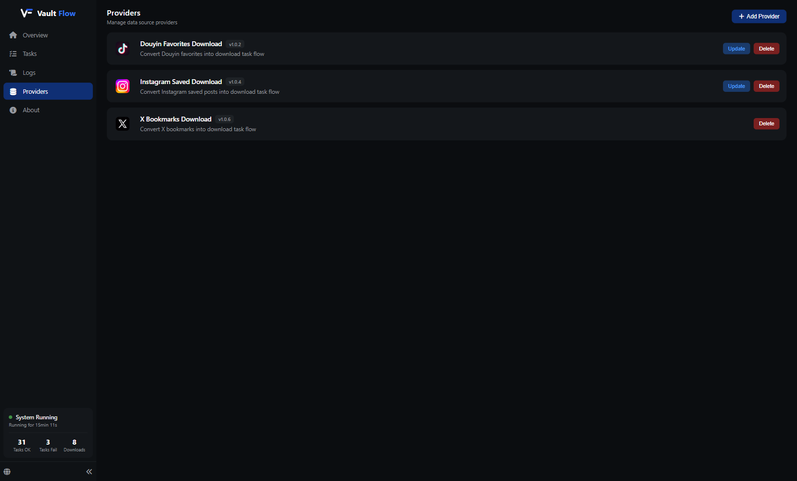

# Vault Flow

[简体中文](README_ZH.md) | English

A timer-driven automation platform with a pluggable provider architecture for social media content collection.

<p align="center"></p>
<p align="center"></p>
<p align="center"></p>

---

## What is Vault Flow

Vault Flow is a self-hosted automation platform. It periodically executes provider-defined tasks — downloading favorited or bookmarked content from social media platforms and organizing them locally.

The core program handles task scheduling, execution orchestration, progress tracking, download management, and web UI. All platform-specific logic lives in independent provider packages, keeping the core clean and extensible.

---

## How it works

1. Install a provider (e.g. Douyin, X, Instagram) from the Providers page
2. Create a task — select a provider, fill in credentials, set an interval
3. The scheduler automatically runs the task at the configured interval
4. The provider collects items, downloads files, and reports progress
5. Downloaded files are organized locally by the provider

---

## Features

- **Provider system** — independent packages for each platform, install/update/remove via Web UI
- **Task scheduling** — cron-like interval execution with manual trigger support
- **Real-time progress** — SSE push for task status, download progress, and logs
- **File preview** — inline image/video preview with keyboard navigation
- **Download management** — status tracking, retry, file size recording
- **Log viewer** — filtered by level (info/warn/error), real-time updates
- **Multi-language** — Chinese (Simplified/Traditional) and English
- **Docker ready** — single image deployment with volume mounts

---

## Quick Start

### Local

```bash
npm install
npm run dev        # starts both server (:3000) and web UI (:5000)
```

Open `http://localhost:5000`.

### Build & Run Locally

```bash
npm install
npm run build
npm run start:server
```

Open `http://localhost:5000`.

### Docker

```bash
docker compose build
docker compose up -d
```

Open `http://localhost:5000`.

---

## Environment Variables

| Variable | Description | Default |
|----------|-------------|---------|
| `SERVER_HOST` | API server bind address | 127.0.0.1 |
| `SERVER_PORT` | API server port | 3000 |
| `WEB_HOST` | Web UI bind address | 0.0.0.0 |
| `WEB_PORT` | Web UI port (also used as server port when `SERVE_STATIC=true`) | 5000 |
| `SERVE_STATIC` | Serve web UI from server (production/Docker mode) | false |
| `CHROME_PATH` | Chrome/Chromium binary path | Required |
| `DOWNLOAD_DIR` | Where downloaded files are saved | `~/vault-flow/downloads` |
| `DATA_DIR` | Data directory (database, provider storage) | `~/vault-flow/database` |
| `PROVIDER_DIR` | Where providers are installed | `~/vault-flow/provider` |
| `MAX_RUNNING_TASKS` | Concurrent task limit | 2 |

---

## Architecture

```
vault-flow/
├── server/        NestJS backend
│   ├── api/       REST endpoints
│   ├── browser/   Provider registry & task runner
│   ├── scheduler/ Cron-based task scheduler
│   └── database/  SQLite (WAL mode)
├── web/           Vue 3 + Vite frontend
├── providers/     Built-in provider configs
└── docker-compose.yml
```

The server manages tasks, scheduling, and provider lifecycle. Providers are loaded dynamically at startup from `PROVIDER_DIR`. The web UI communicates via REST API and Server-Sent Events.

---

## Provider System

Providers are independent npm packages implementing the `VaultProvider` interface from `@vault-flow/provider-api`.

Each provider package contains:

- `manifest.json` — name, icon, version URL, config schema
- `dist/index.js` — compiled provider implementation

Built-in providers (Douyin, X, Instagram) can be installed from the Web UI with one click. Custom providers can be developed and installed manually.

See [`vault-flow-provider-api`](https://github.com/TanMusong/vault-flow-provider-api) for the full API reference.

---

## Security

- All data is stored locally — nothing is uploaded to external servers
- Credentials and configurations are stored in plaintext in the local SQLite database and provider storage files
- The core program does not inspect or interpret provider-stored credentials
- **Providers are third-party code — review and confirm their safety before use**

---

## Requirements

- Node.js 22+
- Chrome or Chromium (via `CHROME_PATH`)
- Docker (optional)

---

## License

MIT

---

## Sponsor

If you find this project helpful, consider buying me a coffee:

<a href="https://ko-fi.com/tanmusong" target="_blank"></a>

<a href="https://www.afdian.com/a/tanmusong" target="_blank"></a>
